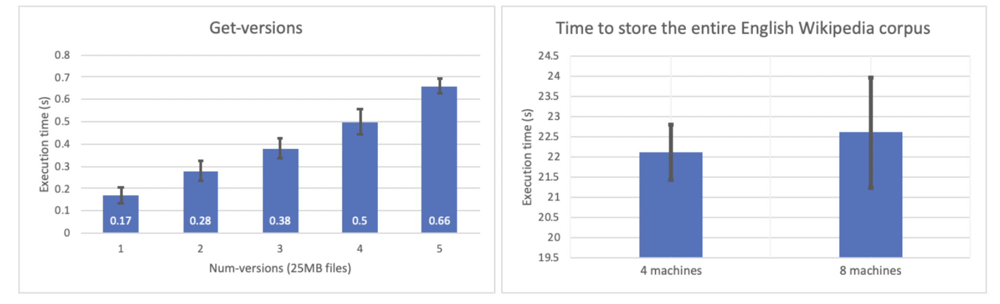

Author: Guangya Wan, Zongjun Liu

# CS 262 Final Project Write-up Distributed File System

## Objective: 

Design and implement a simple distributed file system that is scalable and can tolerate up to three simultaneous machine failures.

## Goals:

1. Build a simplified version of Hadoop Distributed File System that runs on multiple machines.

2. Ensure data is quickly re-replicated after failures.

3. Implement a flat file system with no concept of directories.

4. Ensure distributed file system is a versioned file system with mandatory requirements.

5. Handle all failure scenarios.

6. Keep design simple and fast.

## Implementation plan:

1. Scalability:

As the number of servers increases, distributed file system should be able to handle increased load without sacrificing performance.

2. Failure Tolerance:

Distributed file system should be able to tolerate up to three simultaneous machine failures without losing data.

Data should be quickly re-replicated after failures to ensure continuous functionality.

3. File Operations:

Implemented the required file operations (put, get, delete, ls, store, and get-versions) to interact with the distributed system.

4. Versioned File System:

Implemented consistency levels using W (write) and R (read) replicas to ensure fast writes and reads.

5. Updates to a file are totally ordered.

A read returns the latest written and acknowledged value.

Implemented get-versions to retrieve the last num-versions of a file.

6. Failure Handling:

Identified possible failure scenarios and ensured the system does not hang.

If a node fails and rejoins, it wipes all file blocks/replicas it is storing before rejoining.

7. Design Choices:

Decided whether to replicate an entire file or shard and replicate each shard separately.

Implemented a master server responsible for deciding which files get stored where.

Implemented a master election process in case of master server failure.

Explored options for active/passive replication, read/query processing, caching, and quorum selection.

8. Testing and Logging:

Created logs at each machine to record file operations.

Wrote unit tests for basic file operations.

## Summary: Distributed Group Membership System:

### Design Choice:

We will adapt a Gossip protocol here. In Gossip protocol, nodes in the network periodically exchange information with each other, usually by selecting a random or predetermined set of neighbors. The exchanged information can be any data, and here specifically for updates to the system state, new events, and failure detection. The protocol works in an asynchronous, decentralized manner and is resilient to node failures and network partitions

Key characteristics of Gossip protocols include:

1. Scalability: Gossip protocols can handle a large number of nodes, making them suitable for large-scale distributed systems.

2. Fault-tolerance: The protocol can tolerate node failures, as information dissemination does not rely on a single centralized point of communication. Even if some nodes fail, the information will still spread throughout the network.

3. Robustness: Gossip protocols are resistant to network partitions and can recover once the partitions are resolved. They can also adapt to changes in the network topology.

4. Simplicity: The protocol is simple to understand and implement, as it does not require complex algorithms or data structures.

### Node Representation and Initialization

Each node in the distributed system is represented by a `Node` class (lines 35). The class constructor initializes various parameters, such as the ping port (used for sending and receiving PING and ACK messages between the nodes in the distributed file system. PING messages are used to check the health of other nodes in the system, and the corresponding ACK messages are sent in response to acknowledge the receipt of PING messages), membership port (used for sending and receiving membership update messages between the nodes in the distributed file system. Membership updates are used to inform other nodes about changes in the membership list (e.g., adding or removing nodes).), and logging filepath (This is the file path where log information about the node is stored. The log information typically includes node activities like joining or leaving the system, as well as any errors or other relevant events), as well as several locks (preventing race conditions and ensuring the consistency of the data like membership_list, ack_cache, commands) and internal data structures (help maintain the system's state and allow efficient lookups and updates) to manage state and ensure thread safety.

When a node starts, the `join` method (lines 297) is called to register it with the group. The method assigns a unique ID to the node based on its host address and current timestamp (line 302). If the node is an introducer (The Master Node), it initializes its membership list with itself. Otherwise, it contacts the introducer to obtain the current membership list (311).
Then, we will start three threads to handle different aspects of the node's operation:

a. membership_thread: Handles membership-related tasks, such as updating the membership list.
b. ping_disseminate_thread: Handles the dissemination of ping messages to other nodes.
c. ping_ack_receive: Receives ping acknowledgments from other nodes.

### Failure Detection and Fault Tolerance

The code implements a gossip-style failure detection mechanism. The `ping_disseminate_thread` method (lines 157) periodically sends ping messages to a subset of random nodes in the `ping_thread` (lines 198). The `ping_ack_receive` method (lines 177) listens for ping and ack messages and handles them accordingly using the `handle_ping` (lines 250) and `handle_ack` methods (lines 267). 

There is only one group at any point of time. Since we’re implementing the
crash/fail-stop model, when a machine rejoins, it must do so with an id that
includes a timestamp - this distinguishes successive incarnations of the same
machine (these are the ids held in the membership lists). Notice that the id also
has to contain the IP address.

A machine failure is reflected in at least one membership lists within 5
seconds (assuming synchronized clocks) – this is called time-bounded completeness,
A machine failure, join or leave must be reflected within 6 seconds at all membership lists,
assuming small network latencies (check Bandwidth).

### Bandwidth Efficiency

The code attempts to minimize bandwidth usage by using UDP and a selected subset of nodes for pinging (Lines 92,258). UDP is a connectionless protocol that doesn't guarantee the delivery of packets. It doesn't establish a connection before sending data and doesn't handle retransmissions or acknowledgments. This results in less overhead and lower bandwidth usage. Also, in a large distributed system, it would be inefficient for each node to communicate with every other node directly. Instead, the code selects a subset of nodes to send ping messages. This approach reduces the number of messages exchanged and the overall bandwidth usage.

We will use the `bandwidth` and `reset_time` commands (lines 245-252) can be used to monitor bandwidth usage.

With the above system, we will use the membership information to manage data storage, replication, and retrieval across nodes in the system. The membership system maintains a list of active nodes and their statuses, which helps the distributed file system make decisions about where and how to store and access data. The next step would be a distributed file system.

### Code Docs:

1. Server.py

This Python script implements a distributed membership system with nodes that can join and leave the system. Each node can ping other nodes, receive acknowledgements (acks), and handle failures. The nodes maintain a membership list and can log events such as node joins, leaves, and failures.

'ping_thread': This method generates a unique 'ping_id' and sends a 'ping' message to up to 4 neighbors using the transmit_message method. It then waits for a specified ping_timeout period, and after the timeout, checks the received 'ack' messages in the ack_cache. If an 'ack' from any of the neighbors is missing, it updates the membership list by removing the failed node and sends a 'failed' command to other nodes in the system.

'ping_disseminate_thread': This method is responsible for periodically initiating the pinging process. It runs in a loop, and at each iteration, it sleeps for a specified ping_interval. After each sleep, it starts a new ping_thread.

'ping_ack_receive': This method runs continuously in the background, listening for incoming 'ping' and 'ack' messages on the ping_port. When a message is received, it calls either handle_ping or handle_ack based on the message type.

'handle_ping': This method is called when a 'ping' message is received. It sends an 'ack' message back to the sender, indicating that it is still alive.

'handle_ack': This method handles received 'ack' messages. It updates the ack_cache with the sender's member_id to keep track of which nodes have responded.

'update_membership_list': This method updates the membership list by either adding or removing a member, depending on the action parameter. When a node failure is detected, this method is called to remove the failed node from the membership list.

In summary, the failure detection mechanism in this distributed file system is achieved through periodic pinging of neighbor nodes and expecting 'ack' messages in response. If a node does not receive an 'ack' within a specified timeout, it considers that neighbor as failed, updates the membership list, and notifies other nodes in the system. This mechanism allows the system to detect failures and maintain an updated membership list, which is crucial for maintaining fault tolerance and replication of files across the nodes.

## Summary: Distributed File System:

### Overview

This documents the design and implementation of a distributed file system (DFS) based on the previous DMS. The DFS is a versioned file system that adheres to the following requirements:

1. Consistency levels with writes acknowledged by at least W (2) replicas, and reads by at least R (2) replicas.
2. Totally ordered updates for each file.
3. Reads return the latest written (and acknowledged) value.
4. A `get-versions` command that retrieves the specified number of versions for a given file.
5. Assumes num-versions is no more than 5 for simplicity

## Design choices

The system utilizes a previously implemented membership protocol to maintain a list of participating nodes. It also uses a centralized file server to store and manage metafiles in the distributed file system.

### Membership Protocol
The membership protocol is responsible for maintaining a list of active nodes in the system. It employs a ping-ack mechanism to monitor the status of nodes and updates the membership list accordingly ( see more details in the above section).

### Failure Handling
The system ensures proper handling of node failures and rejoins. When a node fails and rejoins, it wipes all file blocks/replicas it is storing before rejoining. The system handles failure scenarios, such as a node failing before or after receiving the confirmation notice.

Also, files are typically replicated across multiple nodes for fault tolerance and redundancy. When a node fails, the DFS will make sure that the files stored on the failed node are still available on other nodes in the network.

### Replication and Fault Tolerance in the Code

1. Replication: When a file is added to the system, the system stores replicas of the file on different nodes. This is handled outside the FMaster.py file. When the FMaster receives a 'put_notice' (L80-90), it updates the node_to_file and file_to_node mappings with the new file and node information. This ensures that the FMaster is aware of the location of each file replica.

2. Failure detection: In the FServer class, the ping_thread() method is responsible for detecting failures. It sends "ping" messages to other nodes in the system and waits for an "ack" (acknowledgment) response. If a node fails to send an acknowledgment within the specified ping_timeout, the system considers the node to have failed. The list of failed nodes' IP addresses is collected in the fail_ip list.

3. Recovery and fault tolerance: When a node is detected as failed, the FServer class sends a 'fail_notice' message to the FMaster class, containing the IP addresses of the failed nodes. The FMaster class then starts a new thread for each failed IP address and calls the repair() method.

The repair() method does the following:

a. Removes the failed node from the node_to_file and file_to_node dictionaries.
b. Re-replicates the files that were stored on the failed node to other available nodes. This is done by calling the issue_repair() method, which sends a 'repair' command to another node.

The other node that receives the 'repair' command in the FServer class executes the handle_repair_request() method. This method is responsible for ensuring the file is still available in the system after the node failure. It first checks if the file is present on the receiving node. If the file is present, no further action is needed, as the file is already replicated and available in the system. However, if the file is not present on the receiving node, the handle_repair_request() method calls the handle_replicate() method to replicate the file to another available node in the network. This step ensures that the file remains available and fault-tolerant, even if the original node has failed. It will try this to the next 3 nodes in the membership list that is not part of the deleted ips.

These mechanisms help to maintain fault tolerance in the distributed file system by ensuring that there are always multiple replicas of each file available on different nodes.

### File Server
The file server manages file storage and retrieval, ensuring consistency and versioning requirements. It communicates with other nodes using socket connections and follows the consistency levels of W and R replicas. The implementation uses W=2 and R=2, ensuring 2 ack is the least value that satisfies the consistency requirement.

### Code Docs:

1. FMaster.py:

The FMaster class is responsible for managing the metadata of the distributed file system, handling node failures, and ensuring that files are properly replicated across the system. Here's a brief explanation of the methods and their roles in the system:

Funcionality:

'__init__': Initialize the instance variables, including dictionaries for maintaining the mapping of nodes to files and files to nodes, as well as locks for thread synchronization.

'repair': Handle the failure of a node by re-replicating files stored on that node to other available nodes.

'issue_repair': Send a repair command to a specific node to re-replicate a file.

'background': Continuously listen for incoming commands and handle them accordingly (e.g., fail_notice, put_notice, delete_notice).

'get_addr_thread': Continuously listen for incoming connections and send back the list of nodes storing a requested file.
run: Start the background and get_addr_thread and enter an interactive loop to handle user commands, such as printing the current state of node-to-file and file-to-node mappings.

The main script initializes an FMaster instance and calls its run() method to start the metadata management service. The code assumes that the system uses a single master node to manage file metadata, and the master communicates with other nodes through sockets.

2. file_server.py

This code defines a distributed file server (FServer) that supports operations like put, get, delete, list, and repair files across multiple nodes. The FServer extends a server.Node class and maintains a membership list of connected nodes. It also defines a FileTable class to manage files stored at each machine.

'put': This command uploads a local file to the distributed file system.

1: Extracts the local file path and file ID from the command.

2: Obtains a list of IP addresses where the file will be stored.

3: Starts a new thread for each IP address to handle the put operation.

4: Waits for acknowledgment of the file put operation, then prints a completion message.

'get': This command downloads a file from the distributed file system to a local file path.

1: Extracts the file ID and local file path from the command.

2: Obtains a list of IP addresses where the file is stored.

3: Starts a new thread for each IP address to handle the get operation.

4: Waits for acknowledgment of the file get operation, then saves the file locally and prints a completion message.

‘delete’: This command deletes a file from the distributed file system.

1: Extracts the file ID from the command.

2: Obtains a list of IP addresses where the file is stored.

3: Starts a new thread for each IP address to handle the delete operation.

‘store’: This command displays all the files stored on the current node.

‘ls’: This command lists all the IP addresses where a specific file is stored.

‘get_versions’: This command downloads multiple versions of a file from the distributed file system to a local file path.

1: Extracts the file ID, number of versions, and local file path from the command.

2: Obtains a list of IP addresses where the file is stored.

3: Calls the handle_multiple_get method for each IP address.

4: Waits for acknowledgment of the file get operation, then saves the file locally and prints a completion message.

Other commands such as leave, list_mem, debug, list_self, bandwidth, and reset_time are also supported for node management, debugging, and monitoring purposes.

3. Key Data Structures
1. `FileTable`: A class that manages file storage, versioning, and metadata. (L73-187)
2. `file_cache`: A dictionary that stores the files fetched from other nodes. (L214)
3. `ls_cache`: A dictionary that caches the results of ls operations. (L215)
4. `put_ack_cache`: A dictionary that keeps track of put operation acknowledgments. (L216)
5. `get_ack_cache`: A dictionary that keeps track of get operation acknowledgments. (L217)

In summary, the code handles failure detection through periodic pinging and waiting for acknowledgments, just like what we did in the distributed file system. It achieves recovery and fault tolerance by re-replicating files from failed nodes to other available nodes in the system.

# Appendix

## Computing Resources:
We will be using the AWS EC2 machines. We will use 6 nodes VMs for the demo, but the code is expected to run on more than 6.

## Experiments

The first figure shows some basic commands such that we can list all available members’s ip.. For the second figure, we first push a file called server.py to the FS with name new_server.py. You can see once the file it put, it will receive 4 acknowledgement, meaning that it has been replicated to these 4 machines. We can also use the get command to get this new_server.py locally with a new name test.py, and it will also get 4 acknowledgements, meaning that the file exits in those 4 machines and the operation will just copy the content from one of these 4. You can also try the get version command to get a specific version of the file, 0 here just means the first verison, and you can also delete the files from the server. 

The third plot shows two experiments measures the get_versions operations and the time to make put with different number of nodes. We expected that the time will increase as the number of version increases( as there are more version file data to be transferred), and the experiments matches our expectation, and we also expected there are no differece to upload (put) the same data into 4 and 8 machines, because we set the number of replica to be 4, and the total operations would be the same. The results on right also matches our expectation

## Unit Test

### Test on FMaster (test_FMaster.py):

This test code consists of a unit test class, TestFMaster, that tests the functionality of the FMaster class. The FMaster class is imported from the FMaster module, along with the MASTER_PORT and FILE_PORT constants. The test suite uses Python's built-in unittest framework and the unittest.mock library for mocking objects.

### Test on Server (test_server.py):

This test code defines a unit test class NodeTestCase that tests the functionality of the Node class, which is imported from the server module. The test suite uses Python's built-in unittest framework and the unittest.mock library.

### Test on file Server:

Due to time limit, we didn't have a chance to write test code for file sever, and we plan to finish that after the semester ends.

## What we learned

After implementing the Distributed File System, we learned the following:

Design and planning: The importance of thorough planning and designing a distributed file system to ensure scalability, fault tolerance, and efficient data storage.

Consistency levels: The use of read and write consistency levels (W and R) to make writes and reads fast, while maintaining a balance to avoid conflicts and ensure data integrity.

Versioning: Implementing a versioned file system that totally orders all updates to a given file and allows users to retrieve different versions of a file.

Handling failures: The need to consider various failure scenarios and implement mechanisms to handle them, ensuring the system doesn't hang or lose data.

Election and replication: Exploring different methods for electing a master server and implementing replication strategies, such as active or passive replication, to maintain data redundancy and fault tolerance.

Performance optimization: Optimizing read and write operations by leveraging caching and efficient data storage techniques.

Logging and debugging: The significance of maintaining logs for each machine and utilizing tools from previous assignments for debugging and testing.

Testing and evaluation: The importance of conducting thorough testing, measuring performance metrics, and evaluating the system based on real-world scenarios.

Documentation and reporting: The value of documenting design decisions, implementation details, and presenting performance measurements in a concise and informative report.

Overall,this project allowed us to explore what we learned about distributed file systems and their design principles. We explored replication, sharding, failure handling, and consistency levels through the implementation of the distributed file system. 

